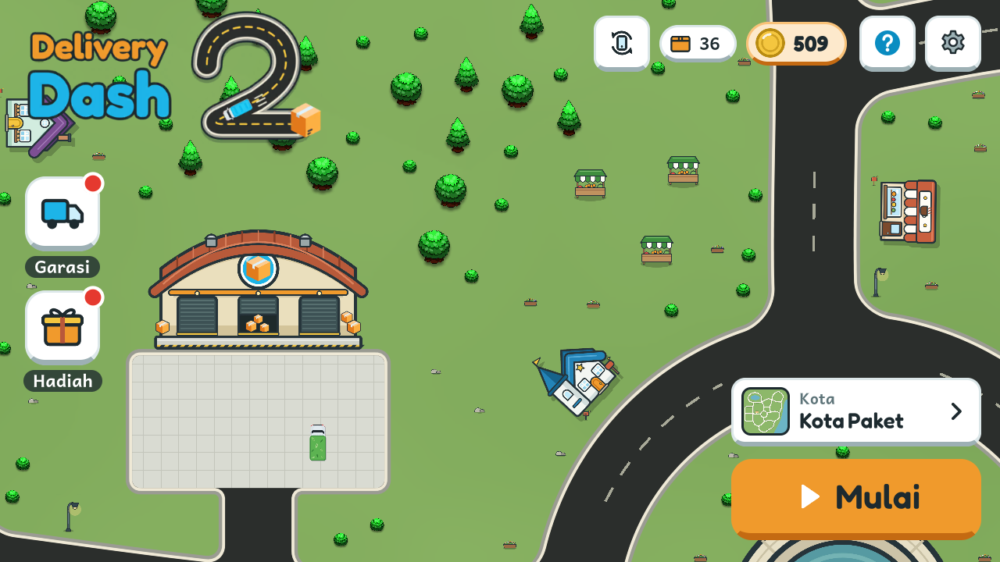
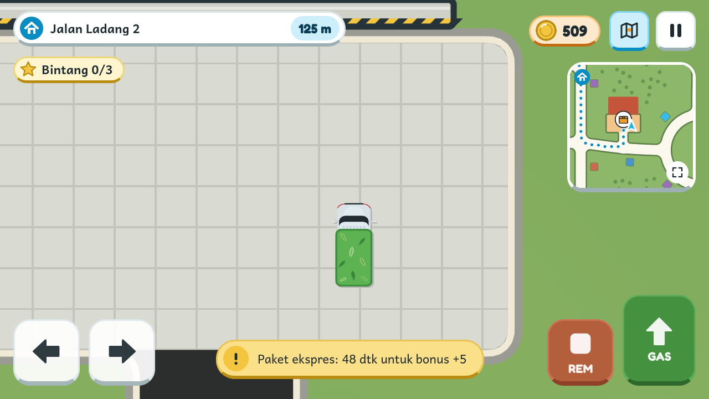
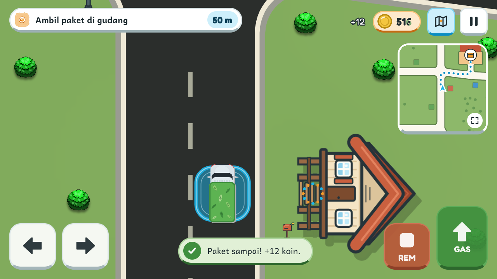
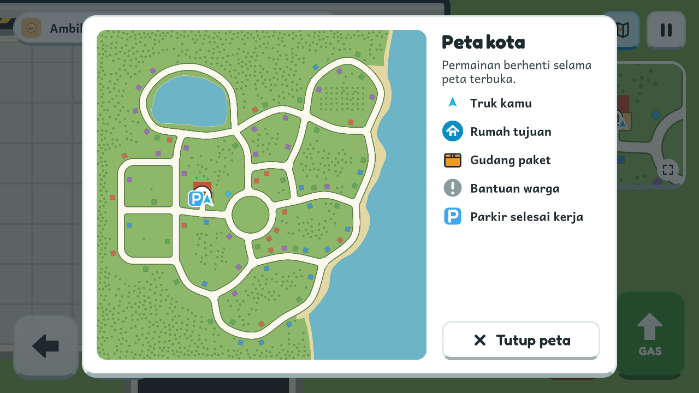
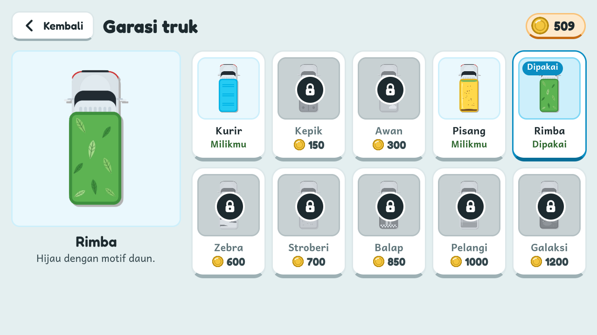
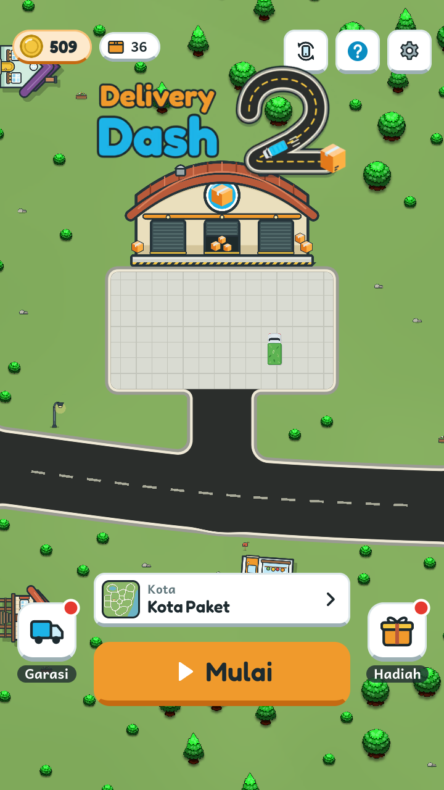

<h1 align="center">Delivery Dash 2</h1>

<p align="center">
  Game antar paket 2D untuk Android. Ambil paket di gudang, lalu antarkan ke rumah pelanggan di seluruh kota.
</p>

<p align="center">
  <a href="https://github.com/Nijika21/delivery-dash-2/releases/latest/download/DeliveryDash2.apk">
    
  </a>
</p>

<p align="center">
  <a href="https://github.com/Nijika21/delivery-dash-2/releases/latest">Halaman rilis terbaru</a>
</p>

<p align="center">
  
</p>

## Tentang

Delivery Dash 2 adalah game mengemudi dengan tampilan dari atas. Pemain mengendalikan truk pengantar, mengambil paket di gudang, lalu mengantarkannya ke rumah tujuan di sebuah kota yang dapat dijelajahi dengan bebas. Setiap pengantaran menghasilkan koin yang dapat digunakan untuk membeli tampilan truk baru di garasi.

Game ini dapat dimainkan tanpa internet dan tidak memuat iklan maupun pembelian dalam aplikasi. Progres pemain disimpan di perangkat. Kode game tidak mengirim data apa pun; izin internet di daftar izin aplikasi ditambahkan otomatis oleh Unity.

## Tangkapan layar

| Mengantar paket | Paket sampai | Peta kota |
|:---:|:---:|:---:|
|  |  |  |

| Garasi truk | Mode tegak (portrait) |
|:---:|:---:|
|  |  |

## Fitur

- Dua kota, Kota Paket dan Blok Paket, masing-masing dengan jaringan jalan, danau, dan puluhan rumah.
- Paket biasa, paket ekspres dengan batas waktu bonus, paket rapuh yang tidak boleh terbentur, dan kiriman dengan persinggahan.
- Tugas sampingan berupa bantuan warga dan antar surat di sela kiriman utama.
- Bar tujuan dengan jarak rute, panah penunjuk, minimap, dan peta kota.
- Garasi berisi sepuluh tampilan truk yang dibuka dengan koin hasil pengantaran.
- Hadiah harian dan bintang yang dapat dikumpulkan selama bekerja.
- Tutorial untuk pemain baru.
- Posisi mendatar (landscape) dengan tombol, atau tegak (portrait) dengan joystick.
- Mode Classic, yaitu Delivery Dash versi pertama, dapat dimainkan dari dalam game.

## Cara bermain

1. Tekan **Mulai** di lobby. Pemain baru langsung diarahkan ke tutorial.
2. Kendarai truk ke **zona jingga di depan gudang** dan berhenti di dalamnya untuk mengambil paket.
3. Ikuti bar tujuan, panah, atau minimap menuju rumah tujuan, lalu berhenti di zona depan rumah.
4. Koin bertambah setiap kali paket sampai. Kiriman berikutnya menunggu di gudang.
5. Untuk mengakhiri sesi, parkirkan truk di **parkir selesai kerja** dekat gudang untuk melihat rangkuman.

### Kontrol

| Aksi | Mendatar (landscape) | Tegak (portrait) | Keyboard |
|---|---|---|---|
| Maju | `GAS` | Geser joystick | `W` / `↑` |
| Rem dan mundur | `REM` | Geser joystick ke belakang | `S` / `↓` |
| Belok kiri | `←` | Arah joystick | `A` / `←` |
| Belok kanan | `→` | Arah joystick | `D` / `→` |
| Jeda | Tombol jeda, tombol Kembali Android | Tombol jeda, tombol Kembali Android | `Esc` |

## Persyaratan

- Android 6.0 (API 23) atau lebih baru, arsitektur ARMv7 atau ARM64.
- Untuk memasang APK di luar Play Store, izinkan pemasangan dari sumber tidak dikenal pada aplikasi yang digunakan untuk membuka berkas APK.

## Membangun dari kode sumber

> **Catatan aset.** Gambar truk, paket, jalan, rumah awal, pohon, dan semak berasal dari aset tutorial pihak ketiga yang lisensinya tidak dapat dipastikan, sehingga tidak disertakan di repositori ini. Yang tidak ikut: folder `Assets/env1/`, skin truk (`Assets/UI/Art/Skin/`), pohon dan semak UI (`Assets/UI/Art/Dunia/`), logo (`Assets/UI/Art/Logo/`), dan ikon aplikasi (`Assets/Art/AppIcon/`). Proyek tetap dapat dibuka, tetapi bagian tersebut tampil kosong dan build APK memerlukan gambar pengganti dengan nama yang sama. APK di halaman rilis sudah berisi semua gambar.

Kebutuhan:

- Unity **6000.2.12f1** dengan modul **Android Build Support** (termasuk OpenJDK dan Android SDK/NDK).
- Node.js (opsional), hanya untuk alat di folder `Tools/`.

Langkah:

1. Klon repositori ini, lalu buka foldernya melalui Unity Hub.
2. Buka scene `Assets/Scenes/KotaPaket.unity` dan tekan Play untuk mencoba di editor. Kota dibangun saat permainan berjalan dari data di `Assets/World/`.
3. Untuk membangun APK, jalankan dari baris perintah:

```bash
Unity -batchmode -quit -projectPath . -buildTarget Android -executeMethod DeliveryDash.Editor.DeliveryProjectSetup.BuildAndroid
```

Hasilnya tersimpan di `Builds/Android/DeliveryDash2.apk`.

Pengujian otomatis:

```bash
Unity -batchmode -quit -projectPath . -executeMethod DeliveryDash.Editor.Tests.StaticChecks.RunBatch
Unity -batchmode -projectPath . -executeMethod DeliveryTownTools.BakeAndTest
Unity -batchmode -projectPath . -executeMethod DeliveryDash.Editor.Tests.ClassicLoopChecks.RunBatch
```

## Struktur proyek

| Lokasi | Isi |
|---|---|
| `Assets/Scenes/KotaPaket.unity` | Scene utama (bootstrap; kota dibangun saat berjalan) |
| `Assets/Scripts/DeliveryGameManager*.cs` | Siklus sesi, ambil dan antar paket, tutorial |
| `Assets/Scripts/KidFriendlyHud*.cs` | Antarmuka permainan (UI Toolkit) |
| `Assets/Scripts/Town/` | Pembangun kota dari data hasil bake |
| `Assets/Driver.cs` | Gerak truk dari tombol sentuh, joystick, dan keyboard |
| `Assets/World/` | Data kota hasil bake (jalan, rumah, tabrakan, minimap) |
| `Assets/UI/` | Layar UXML, gaya USS, font, ikon, dan data gerak |
| `Assets/Classic/` | Mode Classic |
| `Assets/Editor/` | Skrip build, penyiapan aset, dan pengujian |
| `Tools/town-baker/` | Pembuat data kota dari tata letak JSON |
| `Tools/art/`, `ArtSource/` | Sumber vektor dan pengekspor gambar |

## Kredit

- Musik (dari opengameart.org):
  - "Fun Adventure" oleh HitCtrl, dilisensikan di bawah CC BY 3.0.
  - "Seaside Village" oleh Leonardo Paz, dilisensikan di bawah CC BY 4.0.
  - "Forget Me Not" dan "Hot Springs Town" oleh Kistol, CC0.
- Ikon tangan tutorial diadaptasi dari Twemoji, dilisensikan di bawah CC BY 4.0.
- Font Fredoka dan Andika, lisensi SIL Open Font License 1.1 (`Assets/UI/Fonts/`). Font Bangers untuk mode Classic, lisensi yang sama (`Assets/Classic/OFL-Bangers.txt`).
- Truk, paket, pohon, dan semak di APK berasal dari aset tutorial pihak ketiga (tidak disertakan di repositori ini). Rumah, properti, motif tampilan truk, dan antarmuka digambar untuk Delivery Dash 2.
- Dibuat dengan Unity dan Universal Render Pipeline.
